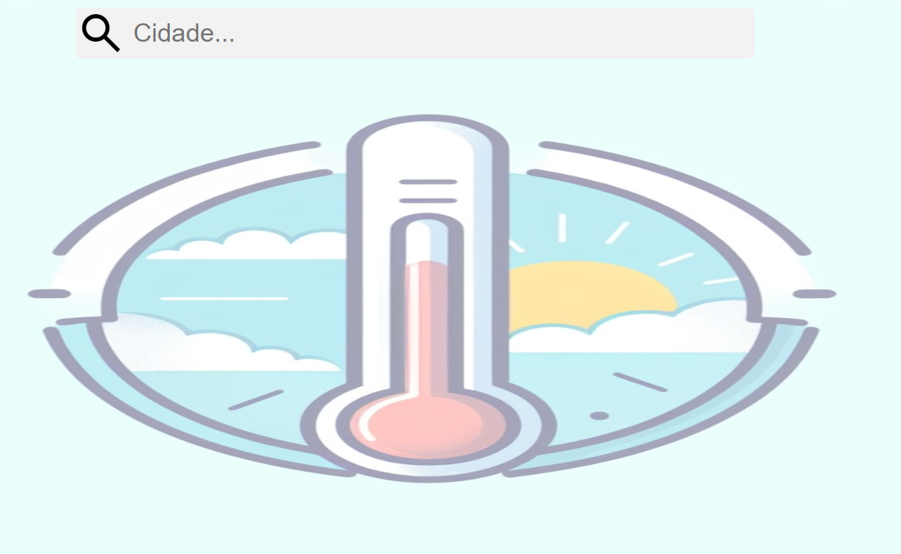
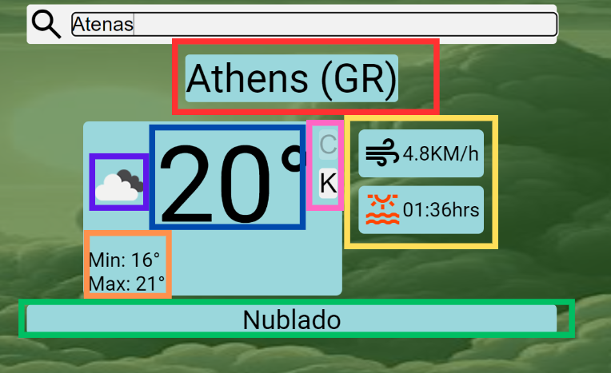
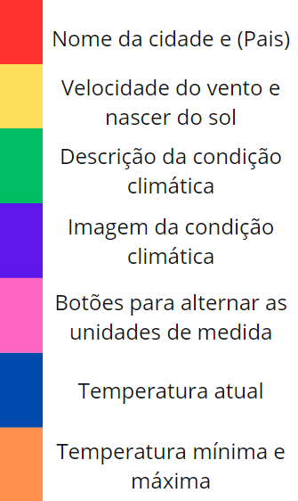

# TSI-Tempo Certo Climatologia
 Site com informções meteorológicas utilizando a API open weather, projeto feito como atividade da matéria de webservices

# Acesse o projeto online
### [Tempo certo climatologia](https://vitorsvnascimento.github.io/TSI-Tempo-Certo-Climatologia/)

# Como utilizar 
- Clique no link do projeto
- ## A tela inicial sera exibida, digite o nome da cidade que deseja e pressione ENTER ou clique no ícone da lupa

- ## Após isso caso a cidade exista as seguintes informações serão exibidas (Legenda abaixo da imagem)

- A cor do fundo é alterada de acordo com a temperatura, quanto mais próximo do vermelho mais quente e quanto mais próximo ao azul mais frio
- A imagem de fundo é alterada de acordo com a condição climática

### Legenda: 

